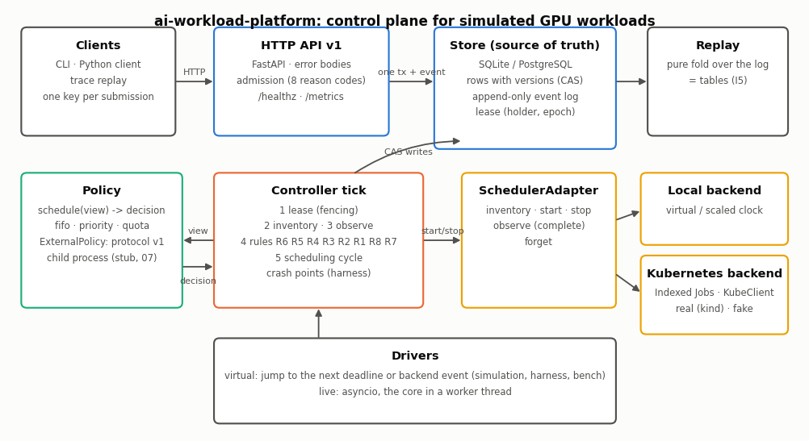
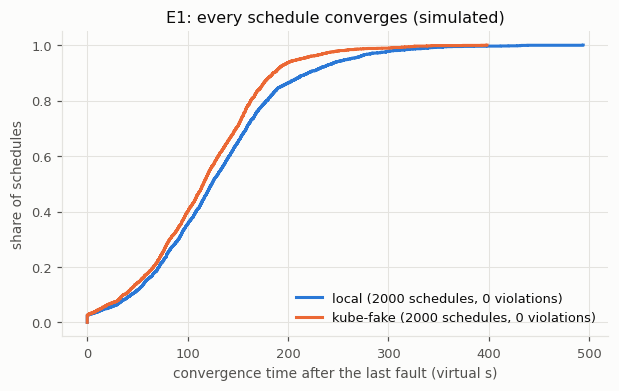
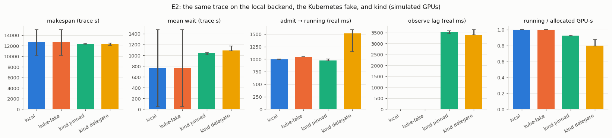
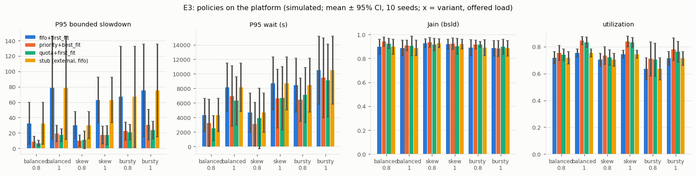
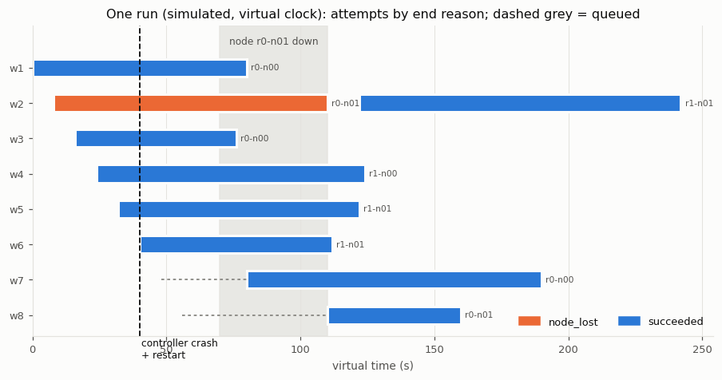

# AI Workload Platform

A control plane for AI workloads on shared GPU compute that keeps its state correct when its parts fail: a versioned store with an append-only event log, a reconciler that repairs the states a crash or a lost node leaves behind (except a node that never comes back; see [TODO](#todo)), a fault-injection harness that checks this after every step, and two execution backends (a deterministic local one and Kubernetes Jobs) behind one contract.

> **Simulated GPUs.** Workloads sleep for their run time; nothing runs a model, and on Kubernetes the GPUs are an advertised extended resource. Every number below says how this control plane behaves under the assumptions stated in this repository — in this simulation, under these assumptions — and nothing about production clusters.

**Status:** Tier 1 done; Tier 2 items 1–4 done, items 5–7 not done; Tier 3 not started (see [Status](#status)).



## What it is, and what it is not

- A workload lifecycle on a versioned state machine (retries with backoff, cancellation, a dead-letter state) whose only source of truth is a store with an append-only event log — SQLite by default, PostgreSQL through the same code.
- Namespaces with quotas, priorities, and admission with clear rejection reasons; a scheduling controller that asks a pluggable **policy** who starts where (three built-in baselines, or any external process that speaks the external-policy protocol of `gpu-cluster-scheduler`).
- A **backend** contract with two implementations: a local backend on an injected clock, and a Kubernetes backend (Indexed Jobs) on a local kind cluster or on a deterministic fake client.
- It is **not** Kueue or Volcano, has **no scheduling algorithm of its own** beyond three baselines (the algorithms live in `gpu-cluster-scheduler`), makes **no claim about production clusters**, and has **no authentication** (`up` binds the API to `127.0.0.1` by default; the container image, the compose file, and the Kubernetes Deployment bind it to `0.0.0.0` inside their networks).

## Results (simulated)

All numbers come from `python -m ai_workload_platform bench --full` (virtual clock), `bench --cluster` (a local kind cluster with simulated GPUs), and the scripts listed in [`benchmarks/README.md`](benchmarks/README.md), with the platform at commit `3b6e03b` (the in-cluster demonstration of Tier 2 ran earlier, on the platform code of commit `5f78c2c`); the manifests in `benchmarks/results/` record the configuration hash, the seeds, the library versions, and the load. Machine: Intel Core i9-14900KF (24 cores, 32 logical processors), 96 GB RAM, Windows 11, Python 3.12.3, shared with another agent run (CPU load sampled before the virtual evaluation with 4 worker processes: 32 %; sampled once before the first kind run: 60 %). Virtual-clock results are deterministic (byte-identical event logs for a seed; in this run a 12-worker and a 4-worker evaluation of the same commit wrote the same result files apart from the wall-clock columns, and only the 4-worker files are committed); wall-clock numbers are from a shared machine and are reported as median [min, max] of 3 repetitions. Every table with every policy: [`benchmarks/results/full/table.md`](benchmarks/results/full/table.md).

### E1 Failure injection (the main result)

Seeded schedules of 20–40 workloads with 1–6 scheduled faults each — controller crashes at seven named points, a paused controller whose lease is taken over, store transaction failures and outages, observe outages and stale snapshots, node loss, attempt crashes and losses, start and stop failures, slow starts, evicted pods, pending Jobs, API errors, policy failures, forced preemptions, cancels racing with the controller's writes, and cap changes — with invariants I1–I6 and I8 checked after every step and the convergence invariant I7 when the run ends ([`docs/failure-injection.md`](docs/failure-injection.md)).

| Backend | Schedules | Invariant violations | Faults injected | Crash points hit | Convergence after the last fault, P50 / P95 / max (virtual s) |
|---|---|---|---|---|---|
| local | 2000 | **0** | 6 539 (16 kinds) | 735 (all 7 points) | 124.3 / 261.3 / 494.1 |
| Kubernetes fake | 2000 | **0** | 6 480 (14 kinds) | 797 (all 7 points) | 115.7 / 211.8 / 398.3 |

Faults injected counts the faults that took effect: a crash, a controller pause, and a racing cancel count only when their point was reached (local: 735 of 986 scheduled crashes, 564 of 622 pauses), the others when they were scheduled; 24 local and 27 fake schedules had no fault that took effect. Convergence is the virtual time from the later of the end of the last fault and the end of the 300 s submission window until every workload is terminal and the backend holds nothing, so it includes the remaining run time of the workloads (815 local and 786 fake schedules count from the end of the submission window).

| Injected bug (a test-only patch) | Local: caught in 200 / first at schedule | Fake: caught in 200 / first at schedule | Caught by |
|---|---|---|---|
| resources released at the stop request (R9) | 176 / 1 | 178 / 1 | I5 (and I4) |
| no epoch check on the lease | 3 / 3 | 1 / 126 | I5 (lease-epoch audit) |
| R5 without its grace | 12 / 32 | 4 / 30 | I3 |
| no version check | 29 / 6 | 27 / 6 | I5 |

Four bugs in the platform were found during development: two by the harness (one of them only by the full evaluation of an earlier commit, where 3 of 4000 schedules stalled after a failed store transaction at a completion), one while checking that the harness catches an injected bug, and one by a rule test; each is described with its seed and fix in [`docs/failure-injection.md`](docs/failure-injection.md). A real-process test kills the live service three times while workloads run and checks the invariants from outside (`tests/test_kill.py`).



### E2 The same trace on three backends

Trace `balanced`, load 0.8, 40 workloads, `fifo+first_fit`. Local and fake: mean ± 95 % CI over trace seeds 1–10 (virtual clock). kind: trace seed 1, `time_scale` 120 (the longest workload sleeps one minute; trace time = real time × 120), median [min, max] of 3 runs; the observe-lag columns are the medians of the run means and of the run maxima.

| Backend | Runs | Makespan (trace s) | Mean wait (trace s) | Admit → running (ms) | Observe lag mean / max (ms) | Placement match |
|---|---|---|---|---|---|---|
| local | seeds 1–10 | 12 622 ± 2 397 | 763 ± 710 | 993 ± 8 | 0 / 0 | 1.00 |
| Kubernetes fake | seeds 1–10 | 12 624 ± 2 397 | 764 ± 710 | 1 050 | 0 / 0 | 1.00 |
| kind, `pinned` | seed 1, 3 runs | 12 395 [12 278, 12 455] | 1 043 [1 009, 1 058] | 974 [963, 1 004] | 3 533 / 4 572 | 1.00 |
| kind, `delegate` | seed 1, 3 runs | 12 375 [12 117, 12 500] | 1 090 [1 086, 1 173] | 1 510 [1 149, 1 586] | 3 396 / 4 394 | 0.22 [0.20, 0.37] |

Admit → running is the time from the platform's `started` commit to its `running` commit; on kind it includes up to one observe interval (1 s). On the virtual clock the local backend starts at once (start latency 0), and its 993 ms is the driver's polling at the observe interval while a start is in flight; the fake reports the start at its modelled latency (50 ms + 1 s). Observe lag is how long after a pod ended the platform recorded it; on the virtual clock the driver observes exactly at the end.

The local backend and the fake agree on makespan and wait. On kind the platform learns of an end 3.4–3.6 s of real time after it happened (run means; the kubelet and the Job controller report it; the maximum, 4.8 s, is within assumption A1's 10 s), and records a start about 1 s after committing it; at `time_scale` 120 those seconds are minutes of trace time, so against the local run of the same trace (seed 1: makespan 10 526 s, mean wait 523 s) the mean wait doubles and the makespan grows by 18 %. The time-scale sweep shows that this is the compression, not the backend: the same trace on kind `pinned` at `time_scale` 60 / 120 / 240 gives a makespan of 11 157 / 12 395 / 14 108 trace s and a mean wait of 517 / 1 043 / 1 894 trace s (medians of 3). In `delegate` mode the kube-scheduler puts only 20–37 % of the workers on the nodes the policy chose (`placement_match`), and the starts take longer. These are properties of a compressed time scale on a shared machine, not a ranking of the backends.



### E3 Policies on the platform

300 workloads, trace seeds 101–110, local backend; P95 bounded slowdown (mean ± 95 % CI) and paired wins against `fifo+first_fit` (W/T/L, 5 % tie band). The stub external policy runs `fifo+first_fit` through the protocol and reproduces it exactly (0/10/0 ties everywhere).

| Variant, load | fifo+first_fit | priority+best_fit (W/T/L) | quota+first_fit (W/T/L) | stub (external) |
|---|---|---|---|---|
| balanced 0.8 | 32.4 ± 27.4 | 8.9 ± 6.9 (10/0/0) | 6.5 ± 3.8 (10/0/0) | 32.4 ± 27.4 |
| balanced 1.0 | 78.7 ± 67.3 | 19.1 ± 10.6 (10/0/0) | 17.0 ± 8.2 (10/0/0) | 78.7 ± 67.3 |
| skew 0.8 | 30.2 ± 17.6 | 9.8 ± 7.5 (10/0/0) | 11.2 ± 11.4 (10/0/0) | 30.2 ± 17.6 |
| skew 1.0 | 62.8 ± 29.4 | 17.3 ± 11.3 (10/0/0) | 17.2 ± 12.3 (10/0/0) | 62.8 ± 29.4 |
| bursty 0.8 | 67.0 ± 65.9 | 22.2 ± 11.9 (9/1/0) | 20.9 ± 10.2 (10/0/0) | 67.0 ± 65.9 |
| bursty 1.0 | 75.5 ± 60.2 | 30.5 ± 19.8 (10/0/0) | 23.8 ± 11.6 (10/0/0) | 75.5 ± 60.2 |

The differences have the shape the policies imply: `fifo+first_fit` blocks behind a large workload at the head of the queue, so its tail slowdown and its SLO attainment (0.37–0.73) are worst; the two skipping policies meet the wait targets of the high-priority classes far more often (0.88–0.97) and keep the cluster busier. The intervals are wide because run times are heavy-tailed. This shows that the platform runs the policies; it is not a policy benchmark (that is `gpu-cluster-scheduler`).



### Tier 2

- **Preemption with checkpoints** (same E3 traces, paired with the base policy): `priority+best_fit+preempt` raises SLO attainment in every setting (for example 0.928 → 0.990 at `balanced` 1.0) but worsens the P95 bounded slowdown on most seeds (it loses on 6–8 of 10), and a run loses 7.9–13.5 GPU-hours of work and spends 6.6–11.4 GPU-hours in restart overhead (means per setting); `quota+first_fit+reclaim` preempts a third to two thirds as often, raises SLO attainment less (by 0.01–0.02), and has no consistent effect on the slowdown (wins and losses split). Table: `benchmarks/results/full/table.md`; figure: `docs/figures/e3_preemption.png`.
- **A real policy through the protocol, job by job**: the policy server of `gpu-cluster-scheduler` (`fifo+first_fit+none` and EASY) behind `ExternalPolicy` gives exactly the start times, end times, and placements of that project's own simulator on 3 × 200 workloads (0 differences; `docs/contracts.md` §11).
- **The platform inside the kind cluster**: Deployment with the in-cluster configuration and a least-privilege Role; a 12-workload trace replayed from inside the cluster all succeeded (one run on the platform code of commit `5f78c2c`; no result file is committed, the run is described in `docs/kubernetes.md`).
- **Kubernetes depth** (`docs/kubernetes.md`): the time-scale sweep above; a 2 × 8-GPU gang in `delegate` mode that the kube-scheduler could place only half of (pods of another tenant held three workers) stayed `starting` until R2 ended it after `start_timeout_ms`, and its retry succeeded; a kind worker stopped with `docker stop` while it ran a workload — the platform's inventory showed it not ready 46 s after the stop, R4 requested the stop with reason `node_lost` 30 s later (`node_grace_ms`), the attempt ended when the node came back, and the retry ran 91.5 s after the start of the demonstration (one run); the fake client's start latency set from the kind measurement changes the makespan of a 2000-workload run by less than 0.01 %, so at these run times the fake's assumed start latency does not matter (what it does not model is the end-detection lag).



The timeline above is one run on the virtual clock: a controller crash right after a `started` commit (the write-ahead attempt is started again by R1) and a node lost for 40 s (R4 requests the stop of the attempt on it after `node_grace_ms`, the attempt ends when the node returns, and the workload is retried on another node).

## Build, test, run

Python 3.12. Run from the repository root. The install uses `pip install -e` (the build backend `hatchling` comes from PyPI or your mirror); everything below works without Docker, a GPU, or network access after the install.

Windows PowerShell:

```powershell
python -m venv .venv
.venv\Scripts\python.exe -m pip install -e ".[dev]"
.venv\Scripts\python.exe -m pytest -q
.venv\Scripts\python.exe -m ai_workload_platform bench --quick
.venv\Scripts\python.exe scripts\demo.py
```

Linux or macOS (bash):

```bash
python3 -m venv .venv
.venv/bin/python -m pip install -e ".[dev]"
.venv/bin/python -m pytest -q
.venv/bin/python -m ai_workload_platform bench --quick
.venv/bin/python scripts/demo.py
```

The repository's scripts are plain Python files run with the interpreter (`python scripts/x.py`); if you prefer to run any script directly on Linux or macOS, run `chmod +x` on it once, or prefix it with `python`/`bash`.

Run the service (API and controller in one process; local backend; `--scale 60` makes one wall second one platform minute), then use it:

```bash
python -m ai_workload_platform up --scale 60
python -m ai_workload_platform gen --seed 1 --jobs 20 --out outputs/trace.csv
python -m ai_workload_platform replay outputs/trace.csv --scale 60 --wait
python -m ai_workload_platform submit team-a --spec "{\"gpus\": 2, \"sim\": {\"runtime_s\": 300}}"
```

With PostgreSQL in Docker: `docker compose up` (see `deploy/README.md`). On a kind cluster with the Kubernetes backend: `deploy/README.md`.

Other commands: `simulate` (a trace on the virtual driver, writes the event log), `report` (metrics from a saved event log), `faults` (fault-injection schedules; `--seed N --backend local` reproduces one and prints the violated invariant and the log tail), `bench --full` / `bench --cluster` (the evaluation), `openapi` (writes or `--check`s `docs/openapi.json`).

## Policies

| Name | Order | Placement | When a workload does not fit |
|---|---|---|---|
| `fifo+first_fit` | submit time, id | first fit, nodes in (rack, name) order | stops (blocks the queue) |
| `priority+best_fit` | priority (high first), submit time, id | worker by worker on the node left with the fewest free GPUs | skips it (no reservation: large workloads can starve) |
| `quota+first_fit` | namespaces within their quota first, then borrowers up to the cap | first fit | skips it |
| `stub` / `external:<name>` | an external process speaking protocol v1 (`AWP_POLICY_CMD`, `AWP_POLICY_CWD`) | as the process decides | — |

A policy that fails three times in a row (invalid decision, error reply, timeout, crash, malformed line) is replaced by `fifo+first_fit` until a retry succeeds; the platform never aborts because of a policy.

## API (v1)

`PUT|GET /v1/namespaces/{ns}`, `GET /v1/namespaces`, `POST /v1/namespaces/{ns}/workloads` (201; 200 for an idempotent repeat with the same `Idempotency-Key`), `GET /v1/namespaces/{ns}/workloads[/{id}]`, `POST /v1/namespaces/{ns}/workloads/{id}:cancel`, `GET /v1/events`, `GET /v1/cluster/nodes`, `GET /v1/namespaces/{ns}/usage`, `GET /healthz`, `GET /metrics`. Errors have the body `{"error": {"code", "message", "details"}}` with stable codes (`UNKNOWN_NAMESPACE`, `IDEMPOTENCY_MISMATCH`, `INVALID_SPEC`, `PRIORITY_NOT_ALLOWED`, `NO_INVENTORY`, `UNSCHEDULABLE`, `EXCEEDS_NAMESPACE_CAP`, `DUPLICATE_ID`, `QUEUE_FULL`, `UNKNOWN_WORKLOAD`, `INVALID_REQUEST`, `STORE_UNAVAILABLE`). The full document: [`docs/openapi.json`](docs/openapi.json).

## Status

**Tier 1: done.** Everything in the task's Tier 1 is implemented and its checks pass: 170 tests in the full run with PostgreSQL (`AWP_PG_DSN`) and the kind cluster (`AWP_KUBECONFIG`), 2 more skipped by design (node loss on a real cluster is the separate demonstration; the local backend has no `AlreadyExists`); without PostgreSQL or a cluster those tests are skipped with a message; the full evaluation above, the real-process kill test, `docker compose up`, the Kubernetes manifests (kubeconform), and the CI workflow (actionlint).

**Tier 2:** items 1–4 done — preemption with checkpoints (`+preempt`, `+reclaim`, retained work, restart overhead, the preempt fault in the harness), the platform inside the kind cluster (`docs/kubernetes.md`), a real policy through the protocol that matches the simulator of `gpu-cluster-scheduler` job by job (`docs/contracts.md` §11), and Kubernetes depth (time-scale sweep, `delegate` against `pinned`, partial gang, node loss, the fake from measurements). Items 5–7 (two controllers on PostgreSQL, monitoring, API keys and retention) are not done; see [TODO](#todo).

**Tier 3:** not started.

## Stack

Python 3.12 · FastAPI · Pydantic · SQLite · PostgreSQL (store contract tests and `docker compose`) · prometheus-client · the official Kubernetes Python client · Docker and kind. Redis: not implemented. gRPC: not implemented.

## Repository layout

```text
src/ai_workload_platform/   models, lifecycle, store, admission, policy, scheduler (backends), cluster,
                            controller, observability, api, faults (harness), bench (evaluation)
tests/                      unit, contract, harness, API, kill, and determinism tests
configs/clusters/           cluster configurations (reference, reference-e2, kind)
docs/                       contracts, architecture, kubernetes, failure-injection, openapi.json, figures
benchmarks/                 the evaluation protocol and the committed results
deploy/                     kind cluster, Kubernetes manifests; Dockerfile and docker-compose.yml at the root
scripts/                    demo, kind set-up and demonstrations, conformance, figure scripts
```

Documentation: [contracts](docs/contracts.md) · [architecture](docs/architecture.md) · [Kubernetes backend](docs/kubernetes.md) · [failure injection](docs/failure-injection.md) · [benchmarks](benchmarks/README.md) · [deployment](deploy/README.md) · [implementation plan](IMPLEMENTATION.md).

## TODO

- **Run real containers on real GPUs (Tier 3).** Workloads sleep for their run time on the local backend and as busybox `sleep` in pods on kind; `image` and `command` are stored but not used, and the GPUs on kind are an advertised extended resource without a device plugin.
- **Gang admission on Kubernetes (Kueue, Volcano, JobSet).** Today a gang is atomic only at the platform level; in `delegate` mode the kube-scheduler can leave part of a gang pending, and R2 ends it after `start_timeout_ms`.
- **Run the fault harness on PostgreSQL and on a real cluster.** The harness uses in-memory SQLite and the Kubernetes fake; PostgreSQL runs only the store contract suite and `docker compose`, and the kind cluster runs the backend contract suite, E2 (c), the time-scale sweep, and the partial-gang and node-loss demonstrations.
- **Explore true concurrency in the harness.** Interleavings happen only at named points in a single thread; races inside a transaction or between two simultaneously active controllers are not explored (writers are serialized and the lease makes one controller the writer).
- **Two controllers on PostgreSQL (Tier 2 item 5).** One controller per store today; a standby that takes over by lease after the active one is killed, and the zombie test on real processes, are not built (the zombie is covered in the virtual harness only).
- **Monitoring (Tier 2 item 6).** `/metrics` exists; a Prometheus compose profile, alert rules, and a dashboard do not.
- **Authentication, rate limits, retention (Tier 2 item 7).** There is no authentication: `up` binds to `127.0.0.1` by default, but the container image, the compose file, and the Deployment bind to `0.0.0.0`, so anything that reaches their network can use the API.
- **More external policies.** Only the non-preempting `fifo+first_fit+none` and EASY of `gpu-cluster-scheduler` ran through the protocol (and matched its simulator job by job); its preempting and MILP policies have not been run on the platform.
- **More repetitions on a quieter machine for the wall-clock numbers.** The kind results are 3 repetitions per configuration (one each for the partial-gang and node-loss demonstrations) on a shared desktop machine; they show where the backends differ, not how fast a production cluster is.
- **Model the end-detection lag in the fake client.** On kind the platform records the end of a pod 3.4–3.6 s after it happened; the fake reports it at once. It is the largest difference between the two.
- **A node that never comes back.** The attempt on it stays `STOPPING` with its GPUs booked until the pod object disappears (an operator deletes the node); demonstrated only with a node that returned.
- **Provenance of the demonstration results.** The conformance CSV and the result files of `fake_measured.py`, `kind_node_loss.py`, and `kind_partial_gang.py` carry no manifest; their commit is stated in `benchmarks/README.md` only. Writing a manifest from those scripts would make them self-describing.
- **A dedicated regression test for the wake after a version conflict** (bug 1 of `docs/failure-injection.md`); its schedule came from an earlier version of the generator, so today only the harness as a whole covers it.
- **gRPC and Redis** are not implemented (not needed by any tier so far).

## Reference projects

- [kubernetes-sigs/kueue](https://github.com/kubernetes-sigs/kueue) — queueing and admission for batch workloads
- [volcano-sh/volcano](https://github.com/volcano-sh/volcano) — batch scheduling and gang scheduling on Kubernetes
- [ray-project/ray](https://github.com/ray-project/ray) — distributed execution and AI workload management

## License

MIT
